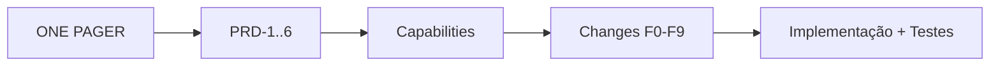

# Plano OpenSpec SDD — Meus Remédios

> Este documento descreve **como** o projeto será especificado e implementado com OpenSpec
> (Spec-Driven Development) na próxima sessão. Os artefatos OpenSpec (`openspec/project.md`,
> capabilities e changes) serão **criados na sessão de implementação**; aqui fica o plano de
> referência.

## openspec/project.md (conteúdo de referência)
- **Produto**: Meus Remédios — confirmação visual de comprimidos, 100% offline, foco idoso.
- **Stack**: Kotlin, Jetpack Compose + Material 3, Hilt, Room, CameraX, TensorFlow Lite,
  Coroutines/Flow, WorkManager, AlarmManager. `minSdk 24`.
- **Convenções**: MVVM + camadas (ui/domain/data); DI via Hilt; nomes em inglês no código,
  textos de UI em pt-BR; testes com JUnit/MockK/Turbine/coroutines-test/Robolectric/Compose
  test; sem rede; manter CHANGELOG.
- **Restrições**: offline total; sem login/nuvem/ads; privacidade (storage privado);
  segurança no reconhecimento (limiar conservador).
- **Comandos**: `./gradlew test`, `./gradlew connectedCheck`, `./gradlew assembleDebug`.

## Capabilities (openspec/specs/<capability>/spec.md)
| Capability | Descrição | PRDs |
|------------|-----------|------|
| `medication-catalog` | cadastro/edição/listagem/busca de remédios | PRD-1, PRD-2 |
| `medication-photos` | fotos do comprimido + extração/persistência de features | PRD-1 |
| `visual-recognition` | captura, scoring e decisão de identificação | PRD-3 |
| `scheduling-reminders` | horários, alarmes exatos, reagendamento no boot | PRD-4 |
| `intake-tracking` | marcar/registrar tomadas e pendentes | PRD-5 |
| `reporting` | relatório do dia, timeline, histórico | PRD-2 |
| `app-settings` | retenção, auto-captura, lembretes globais, limpeza | PRD-6 |
| `accessibility-ui` | requisitos transversais de acessibilidade | TECH-4 |

## Mapeamento Fases → OpenSpec changes
Sugestão de change-ids (verbo + escopo), criados na ordem de dependência:
- **F0** → `add-project-scaffolding` (tooling/estrutura; doc + tasks).
- **F1** → `add-local-data-layer` (Room, entidades, repos, settings).
- **F2** → `add-medication-catalog` + `add-medication-photos` (capabilities 1 e 2).
- **F3** → `add-reporting-and-browsing` (capabilities 2/6).
- **F4** → `add-visual-recognition` (capability 3) + `design.md` detalhado do engine.
- **F5** → `add-intake-tracking` (capability 5).
- **F6** → `add-scheduling-reminders` (capability 4).
- **F7** → `add-app-settings-and-retention` (capability 7).
- **F8** → `add-accessibility-baseline` (capability 8).
- **F9** → `add-test-automation` (estratégia de testes + CI).

## Exemplo de delta de spec (capability `visual-recognition`)
```
## ADDED Requirements
### Requirement: Identificação confiante de comprimido
O sistema DEVE comparar a foto capturada com as fotos cadastradas do usuário e, quando a
confiança do melhor candidato exceder o limiar e a margem sobre o segundo, identificar o
remédio correspondente.

#### Scenario: Comprimido cadastrado e nítido
- **QUANDO** o usuário captura um comprimido cujo remédio está cadastrado com foto
- **ENTÃO** o app exibe "É o Remédio X, tomar às HH:mm"

#### Scenario: Resultado ambíguo
- **QUANDO** a diferença entre os dois melhores candidatos é menor que a margem mínima
- **ENTÃO** o app solicita uma segunda foto do outro lado do comprimido
- **E** combina os resultados antes de decidir

### Requirement: Operação 100% offline
O sistema DEVE realizar todo o reconhecimento no dispositivo, sem qualquer acesso à rede.

#### Scenario: Sem conectividade
- **QUANDO** o dispositivo está sem internet
- **ENTÃO** o reconhecimento funciona normalmente
```

## Fluxo de trabalho na sessão SDD (resumo)
1. Inicializar OpenSpec e criar `openspec/project.md` + capabilities base.
2. Para cada fase: criar a change (`proposal.md` + `tasks.md` + deltas de spec), validar
   (`openspec validate`), implementar, arquivar (`openspec archive`).
3. Manter rastreabilidade **PRD ↔ capability ↔ change** e atualizar o CHANGELOG por feature.

## Rastreabilidade (visão geral)

