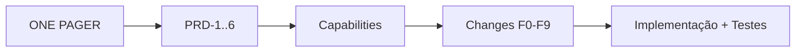
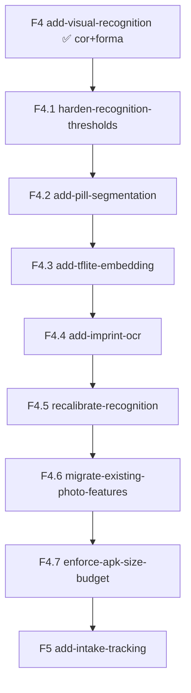

# Plano OpenSpec SDD — Meus Remédios

> Este documento descreve **como** o projeto será especificado e implementado com OpenSpec
> (Spec-Driven Development) na próxima sessão. Os artefatos OpenSpec (`openspec/project.md`,
> capabilities e changes) serão **criados na sessão de implementação**; aqui fica o plano de
> referência.

## openspec/project.md (conteúdo de referência)
- **Produto**: Meus Remédios — confirmação visual de comprimidos, 100% offline, foco idoso.
- **Stack**: Kotlin, Jetpack Compose + Material 3, Hilt, Room, CameraX, TensorFlow Lite,
  Coroutines/Flow, WorkManager, AlarmManager. `minSdk 24`.
  - **Reconhecimento (on-device, offline)**: MobileNetV3 (embedding TFLite) + ML Kit Text
    Recognition *bundled* (OCR de inscrições) + segmentação/detecção do comprimido (TFLite/
    ML Kit Subject Segmentation) + cor (Lab) + forma. Todos os modelos embarcados em
    `assets/`/lib; nenhuma chamada de rede; sem permissão `INTERNET`.
- **Convenções**: MVVM + camadas (ui/domain/data); DI via Hilt; nomes em inglês no código,
  textos de UI em pt-BR; testes com JUnit/MockK/Turbine/coroutines-test/Robolectric/Compose
  test; sem rede; manter CHANGELOG.
- **Restrições**: offline total; sem login/nuvem/ads; privacidade (storage privado);
  segurança no reconhecimento (limiar conservador).
- **Comandos**: `./gradlew test`, `./gradlew connectedCheck`, `./gradlew assembleDebug`.

## Capabilities (openspec/specs/<capability>/spec.md)
| Capability | Descrição | PRDs |
|------------|-----------|------|
| `medication-catalog` | cadastro/edição/listagem/busca de remédios | PRD-1, PRD-2 |
| `medication-photos` | fotos do comprimido + extração/persistência de features (embedding, cor, forma, inscrição) | PRD-1 |
| `visual-recognition` | captura, segmentação, scoring multimodal e decisão de identificação | PRD-3 |
| `pill-imprint-ocr` | leitura on-device de letras/números gravados no comprimido (ML Kit bundled) | PRD-3 |
| `scheduling-reminders` | horários, alarmes exatos, reagendamento no boot | PRD-4 |
| `intake-tracking` | marcar/registrar tomadas e pendentes | PRD-5 |
| `reporting` | relatório do dia, timeline, histórico | PRD-2 |
| `app-settings` | retenção, auto-captura, lembretes globais, limpeza | PRD-6 |
| `accessibility-ui` | requisitos transversais de acessibilidade | TECH-4 |

## Mapeamento Fases → OpenSpec changes
Sugestão de change-ids (verbo + escopo), criados na ordem de dependência:
- **F0** → `add-project-scaffolding` (tooling/estrutura; doc + tasks). ✅ feito
- **F1** → `add-local-data-layer` (Room, entidades, repos, settings). ✅ feito
- **F2** → `add-medication-catalog` + `add-medication-photos` (capabilities 1 e 2). ✅ feito
- **F3** → `add-reporting-and-browsing` (capabilities 2/6). ✅ feito
- **F4** → `add-visual-recognition` (capability 3) + `design.md` detalhado do engine. ✅ feito
  (engine cor+forma; `embedding`/OCR ainda **não** plugados — ver F4.1–F4.7 abaixo).
- **F4.1–F4.7** → **Reconhecimento inteligente (TF)** — objetivo core; detalhado na seção
  seguinte. **Prioridade imediata, antes de F5.** (F4.1 ✅ feito)
- **F5** → `add-intake-tracking` (capability 5).
- **F6** → `add-scheduling-reminders` (capability 4).
- **F7** → `add-app-settings-and-retention` (capability 7).
- **F8** → `add-accessibility-baseline` (capability 8).
- **F9** → `add-test-automation` (estratégia de testes + CI).

## Reconhecimento inteligente (TF) — fases faltantes (objetivo core)
> **Motivação.** A F4 entregou o engine, mas com `embedding == null` o score usa só cor+forma.
> Isso (a) reintroduz "ambíguo" em pílulas parecidas e (b) gera **falsos positivos** — um
> controle negativo real (`frente-druse.jpeg`, remédio diferente) foi reconhecido como
> CONFIANTE com score 0.822 (limiar 0.82), porque a cor dominava e a "forma" era só o aspect
> ratio da foto inteira. Um falso positivo em remédio é **risco de segurança**. Estas fases
> entregam a inteligência prevista no PRD-3/TECH-3: identificar o **comprimido** (não a foto)
> pela **aparência (embedding), inscrições (OCR), cor e forma**, ignorando o fundo.

### Fórmula de score (alvo, ao fim destas fases)
```
score = w1·cosine(embedding) + w2·colorSim(Lab) + w3·shapeSim(forma) + w4·imprintSim(OCR)
```
- `w1` (embedding) é o componente dominante; `w4` (inscrição) desempata letras/números.
- Componentes ausentes são ignorados e o score é renormalizado (mantém retrocompat. da F4).
- Pesos/limiares em `RecognitionParams`, calibrados na F4.5 com conjunto de referência.

### Changes (ordem de dependência)
- **F4.1** → `harden-recognition-thresholds` — **segurança imediata** (sem novas deps). ✅ feito
  - Endurecer `THRESHOLD_CONFIDENT`/`MARGIN` enquanto não há embedding/OCR, de modo que o
    controle negativo **não** seja afirmado como confiante.
  - Promover os testes de controle a permanentes: **positivo** (verso do mesmo remédio,
    score ~0.958 → confiante) e **negativo** (`frente-druse` → nunca confiante).
  - Capability: `visual-recognition`.
- **F4.2** → `add-pill-segmentation` — ❌ **cancelada**.
  Rationale (decidido após F4.5): o usuário fotografa o comprimido isolado (fundo não é
  variável relevante); a calibração empírica com 3 pills visualmente idênticos confirmou que
  a limitação está na **identidade do embedding** (MobileNetV3 genérico não discrimina pills
  da mesma cor/forma), não no ruído de fundo. Segmentação reduziria background mas não
  resolveria a confusão de identidade — o único caminho real é fine-tuning do modelo (TODO
  registrado em `docs/openspec-plan.md` e no README). Adicionar um modelo de segmentação
  aumentaria o APK e a complexidade do pipeline sem ganho proporcional de acurácia para o
  caso de uso real. ML Kit Subject Segmentation também exigiria download (viola offline).
- **F4.3** → `add-tflite-embedding` — **núcleo de inteligência**. ✅ feito
  - Embarcar MobileNetV3 em `assets/`; `FeatureExtractor` real preenche `embedding` no
    cadastro e na consulta (sobre a imagem completa; F4.2 cancelada).
  - **Entregue:** `mobilenet_v3_small.tflite` (MobileNetV3-Small, `224×224×3`→`1024`,
    float32, ~4,1 MB), L2-normalizado, fallback gracioso. **float32 é o padrão** (prioriza
    precisão numa tarefa sensível); int8 fica como **avaliação opcional** na F4.7 (não há
    variante int8 publicada deste embedder e ~4,1 MB num APK de ~33 MB não é gargalo).
    Validar acurácia no golden set (F4.5).
  - Ativa `W_EMBEDDING` (já reservado = 0.6). Capabilities: `medication-photos`,
    `visual-recognition`.
- **F4.4** → `add-imprint-ocr` — **letras/números gravados**. ✅ feito
  - ML Kit Text Recognition *bundled* (offline) lê inscrições; normaliza o texto.
  - Novo campo `MedicationPhoto.imprintText`; nova similaridade `imprintSim` (Jaccard de tokens
    + edit distance) e peso `W_IMPRINT = 0.2`; schema Room v2 + `MIGRATION_1_2`.
  - Guard offline: `INTERNET` removida no merge e confirmada ausente no manifesto mergeado.
  - Capabilities: `pill-imprint-ocr`, `medication-photos`, `visual-recognition`.
- **F4.5** → `recalibrate-recognition` — **calibração final multimodal**.
  - Reequilibrar `W_*` e limiares com um **conjunto de referência** (positivos + controles
    negativos), agora com embedding+OCR disponíveis; relaxar o endurecimento provisório da
    F4.1 sem reabrir falsos positivos.
  - Golden set determinístico de testes (vetores/imagens fixas). Capability:
    `visual-recognition`.
- **F4.6** → `migrate-existing-photo-features` — **reprocessar fotos antigas**.
  - Migração automática: reabrir fotos cadastradas antes da F4.3/F4.4 e gerar
    embedding + imprint faltantes (rotina no startup/WorkManager, idempotente).
    Segmentação excluída do escopo (F4.2 cancelada).
  - Capability: `medication-photos`.
- **F4.7** → `enforce-apk-size-budget` — **orçamento de tamanho de APK**.
  - Definir um **orçamento explícito** de tamanho (modelos em `assets/` + libs) e falhar o
    build/CI se exceder; **avaliar** quantização int8 caso o orçamento aperte (mantendo
    float32 como padrão por precisão), e avaliar download opcional do modelo
    no primeiro uso **só** se permanecer 100% offline (ex.: via app bundle/asset pack, sem
    rede). Documentar tamanhos por modelo. Capability: transversal (tooling/CI).

### Dependências e impacto técnico
- **Novas libs (todas on-device/offline):** TensorFlow Lite runtime + support/task-vision;
  ML Kit Text Recognition *bundled* (modelo embarcado, sem Play Services em runtime).
  Segmentação descartada (F4.2 cancelada — viola offline e sem ganho para o caso de uso real).
- **Modelo de dados (TECH-2):** `MedicationPhoto` ganha `imprintText` (e, se útil, bbox/ROI
  da segmentação); `embedding` (BLOB) já existe.
- **Offline (NFR):** confirmar a cada change que **nenhuma** dependência exige rede e que o
  manifest **não** ganha `INTERNET`; modelos versionados em `assets/`.
- **Tamanho do APK:** **float32 é o padrão** (precisão); manter orçamento explícito e gate de
  CI na F4.7 (`enforce-apk-size-budget`), e **avaliar int8** por modelo só se o orçamento
  apertar — sem sacrificar acurácia numa tarefa sensível.
- **Acessibilidade/UX:** manter decisão conservadora — em dúvida, pedir 2ª foto ou listar
  candidatos; nunca afirmar identidade com baixa confiança.
- **Docs a sincronizar quando estas fases entrarem:** PRD-3, TECH-2, TECH-3 (fórmula com
  `w4`/OCR), README/AGENTS e CHANGELOG. Segmentação removida do escopo.

### Decisões adotadas (autônomas, revisáveis)
- **OCR:** ML Kit Text Recognition *bundled* (offline, melhor precisão em inscrições do que
  Tesseract). Reavaliar Tesseract se quisermos zero dependência do Google.
- **Segmentação:** ❌ cancelada (F4.2). Usuário fotografa pill isolado; limitação é de
  identidade no embedding, não de fundo. Fine-tuning resolve; segmentação não.
- **Embedding:** MobileNetV3 genérico (ImageNet) em **float32** agora (precisão; int8
  opcional na F4.7); **fine-tune específico de comprimidos** fica como tarefa futura (TODO
  no README): treinar/ajustar com as
  **fotos reais do cadastro** de devices controlados (já temos imagens + nome do remédio como
  rótulo), mantendo o pipeline offline.
- **Fotos antigas:** **migração automática** (reprocessamento), sem exigir recadastro.


## Exemplo de delta de spec (capability `visual-recognition`)
```
## ADDED Requirements
### Requirement: Identificação confiante de comprimido
O sistema DEVE comparar a foto capturada com as fotos cadastradas do usuário e, quando a
confiança do melhor candidato exceder o limiar e a margem sobre o segundo, identificar o
remédio correspondente.

#### Scenario: Comprimido cadastrado e nítido
- **QUANDO** o usuário captura um comprimido cujo remédio está cadastrado com foto
- **ENTÃO** o app exibe "É o Remédio X, tomar às HH:mm"

#### Scenario: Resultado ambíguo
- **QUANDO** a diferença entre os dois melhores candidatos é menor que a margem mínima
- **ENTÃO** o app solicita uma segunda foto do outro lado do comprimido
- **E** combina os resultados antes de decidir

### Requirement: Operação 100% offline
O sistema DEVE realizar todo o reconhecimento no dispositivo, sem qualquer acesso à rede.

#### Scenario: Sem conectividade
- **QUANDO** o dispositivo está sem internet
- **ENTÃO** o reconhecimento funciona normalmente
```

## Fluxo de trabalho na sessão SDD (resumo)
1. Inicializar OpenSpec e criar `openspec/project.md` + capabilities base.
2. Para cada fase: criar a change (`proposal.md` + `tasks.md` + deltas de spec), validar
   (`openspec validate`), implementar, arquivar (`openspec archive`).
3. Manter rastreabilidade **PRD ↔ capability ↔ change** e atualizar o CHANGELOG por feature.

## Rastreabilidade (visão geral)


## Reconhecimento inteligente — ordem das changes


