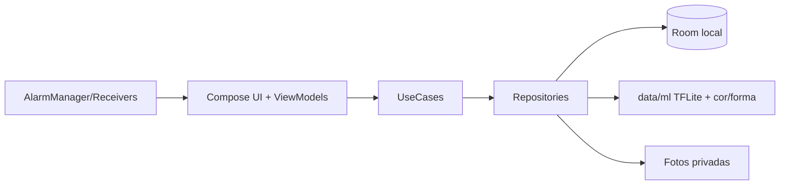

# TECH-1 — Arquitetura

## Estilo
MVVM + camadas (Clean-ish), módulo único `app` organizado por packages. UI declarativa
(Compose) com fluxo de dados unidirecional: `StateFlow → UI`; eventos → `ViewModel` →
`UseCase` → `Repository`.

## Camadas / packages
- `ui/<feature>` — telas Compose + ViewModels (home, recognition, catalog, schedule, reports,
  settings, onboarding).
- `domain/model` — modelos de domínio.
- `domain/usecase` — casos de uso (ex.: `RecognizePillUseCase`, `RegisterMedicationUseCase`,
  `MarkIntakeUseCase`, `ScheduleRemindersUseCase`, `PurgeHistoryUseCase`).
- `data/local` — Room (entities, DAOs, database, type converters).
- `data/repository` — implementações de repositórios.
- `data/ml` — `PillEmbedder` (TFLite), extração de cor/forma, pré-processo de imagem.
- `data/media` — armazenamento de fotos no diretório privado.
- `notifications/` — agendamento (AlarmManager), receivers, canais de notificação.
- `di/` — módulos Hilt.

## Bibliotecas-chave
Jetpack Compose + Material 3 • Navigation Compose • Hilt (DI) • Room • CameraX •
TensorFlow Lite (+ support) • Coroutines/Flow • WorkManager (limpeza) • AlarmManager
(lembretes).

## Diagrama (alto nível)

## Princípios
- Sem dependências de rede (verificado: sem permissão `INTERNET` no manifest).
- Injeção via Hilt para permitir fakes em testes (recognizer fake, DAO in-memory).
- Lógica testável fora da UI (use cases puros/determinísticos).
