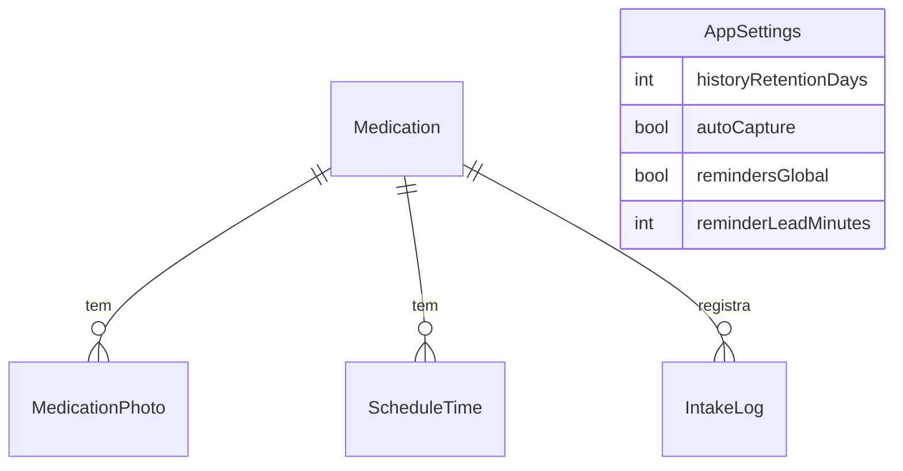

# TECH-2 — Modelo de Dados (Room)

## Entidades
- **`Medication`**(id, name, dosage?, notes?, periodType[continuous|ranged], startDate?,
  endDate?, remindersEnabled, createdAt)
- **`MedicationPhoto`**(id, medicationId→FK, filePath, side[front|back], embedding(BLOB /
  Float[] serializado), dominantColorLab(3 floats), aspectRatio, createdAt)
- **`ScheduleTime`**(id, medicationId→FK, timeOfDay[HH:mm], daysOfWeekMask[bitmask 7])
- **`IntakeLog`**(id, medicationId→FK, scheduleTimeId?→FK, date, scheduledAt, takenAt?,
  status[pending|taken|skipped|late])
- **`AppSettings`**(singleton: historyRetentionDays=90, autoCapture, remindersGlobal,
  reminderLeadMinutes=1, fontScale?, highContrast?)

## Relações
- `Medication` 1—N `MedicationPhoto`
- `Medication` 1—N `ScheduleTime`
- `Medication` 1—N `IntakeLog`

## Type converters
- `LocalDate`/`LocalTime` ↔ texto ISO
- `FloatArray` ↔ BLOB
- enums ↔ string

## Índices
- FKs indexadas.
- `IntakeLog(date)` para relatórios e limpeza.
- `Medication(name)` para busca.

## Migrações
Versionamento Room desde a v1; testes de migração quando o schema evoluir.

## Diagrama (ER simplificado)

