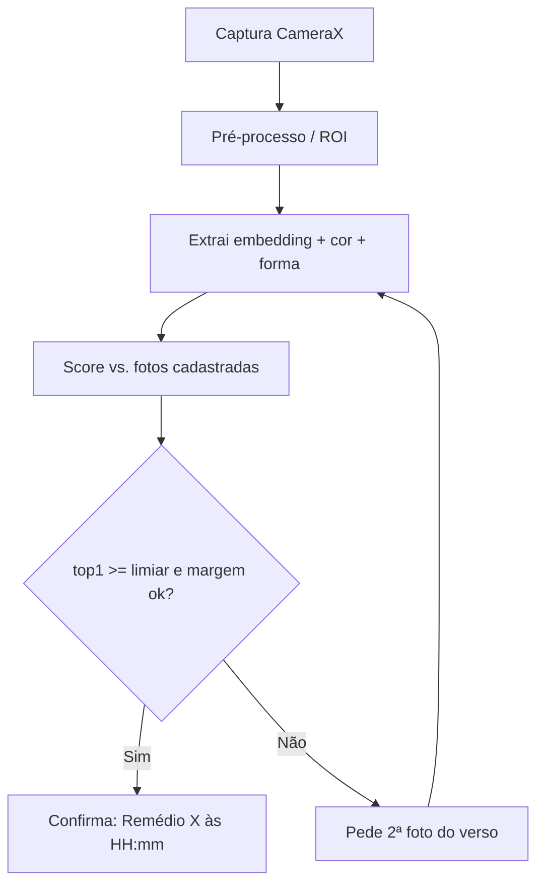

# TECH-3 — Engine de Reconhecimento

## Objetivo
Comparar a foto da câmera com as fotos cadastradas e responder com confiança, **offline**.

## Pipeline
1. **Captura** (CameraX): autofoco; auto-captura quando nítido/estável (config) ou manual.
2. **Pré-processo**: recorte central/ROI, normalização de iluminação simples, resize para a
   entrada do modelo.
3. **Extração de features** (no cadastro e na consulta):
   - `embedding`: vetor do modelo MobileNet TFLite embarcado em `assets/`.
   - `cor dominante` em espaço **Lab** (robusto a brilho).
   - `forma/tamanho`: aspect ratio + descritor simples de contorno.
4. **Scoring** por foto cadastrada:
   ```
   score = w1·cosine(embedding) + w2·colorSim(Lab) + w3·shapeSim(aspect)
   ```
   (pesos default no código; cobertos por testes).
5. **Decisão**:
   - `top1 ≥ THRESHOLD_CONFIDENT` **e** `(top1 − top2) ≥ MARGIN` → **confirma**.
   - caso contrário → **ambíguo**: pedir 2ª foto (verso) e recombinar; ou listar candidatos.
6. **Resultado**: nome do remédio + horário do dia mais próximo; ação "marcar tomado".

## Combinação de 2 lados
Agrega scores das fotos frente/verso (ex.: máximo por remédio ou média ponderada) para
desambiguar pílulas com gravação só de um lado.

## Constantes / parâmetros
`THRESHOLD_CONFIDENT`, `MARGIN`, `w1, w2, w3`, tamanho do embedding — centralizados e testados.

## Considerações
- **Determinismo**: dado um conjunto de embeddings, o ranking é determinístico → testável.
- **Segurança**: limiar conservador; em dúvida, não afirmar.
- **Offline**: 100% on-device; modelo embarcado; nenhuma imagem trafega.

## Decisão de segmentação (recomendado para o MVP)
Recorte central + histograma. ML Kit Subject Segmentation / OpenCV ficam como refinamento
futuro.

## Diagrama do fluxo

