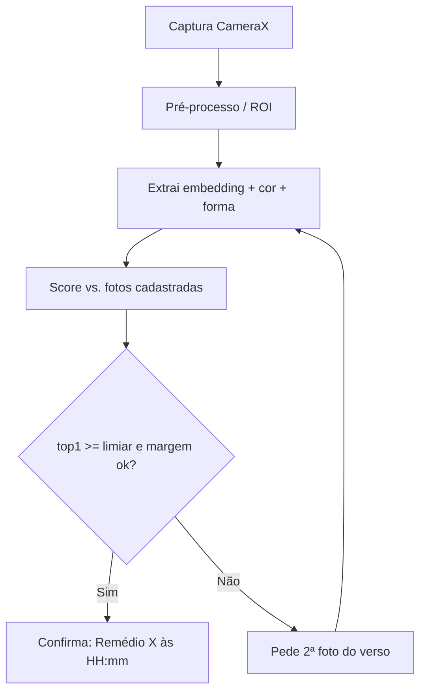

# TECH-3 — Engine de Reconhecimento

## Objetivo
Comparar a foto da câmera com as fotos cadastradas e responder com confiança, **offline**.

## Pipeline
1. **Captura** (CameraX): autofoco; auto-captura quando nítido/estável (config) ou manual.
2. **Pré-processo**: recorte central/ROI, normalização de iluminação simples, resize para a
   entrada do modelo.
3. **Extração de features** (no cadastro e na consulta):
   - `embedding`: vetor do modelo MobileNet TFLite embarcado em `assets/`. **Ativo (F4.3):**
     `mobilenet_v3_small.tflite` (MobileNetV3-Small, entrada `224×224×3`, saída `1024`,
     float32), inferência on-device e vetor L2-normalizado. Falha de carga/inferência →
     `embedding` ausente e o reconhecimento segue com cor + forma (fallback gracioso).
     Quantização int8 e orçamento de APK ficam para a F4.7.
   - `cor dominante` em espaço **Lab** (robusto a brilho).
   - `forma/tamanho`: aspect ratio + descritor simples de contorno.
   - `imprintText`: texto gravado no comprimido lido pelo **ML Kit Text Recognition Latin
     _bundled_** (on-device, sem rede). Ativo em **F4.4** (`add-imprint-ocr`). Fallback
     gracioso: OCR falho/vazio → `null` → componente ignorado.
4. **Scoring** por foto cadastrada:
   ```
   score = w1·cosine(embedding) + w2·colorSim(Lab) + w3·shapeSim(aspect) + w4·imprintSim(OCR)
   ```
   Componentes ausentes são ignorados e o score é renormalizado.
   (pesos em `RecognitionParams`; cobertos por testes; calibração final na F4.5).
5. **Decisão**:
   - `top1 ≥ THRESHOLD_CONFIDENT` **e** `(top1 − top2) ≥ MARGIN` → **confirma**.
   - caso contrário → **ambíguo**: pedir 2ª foto (verso) e recombinar; ou listar candidatos.
6. **Resultado**: nome do remédio + horário do dia mais próximo; ação "marcar tomado".

## Combinação de 2 lados
Agrega scores das fotos frente/verso (ex.: máximo por remédio ou média ponderada) para
desambiguar pílulas com gravação só de um lado.

## Constantes / parâmetros
`THRESHOLD_CONFIDENT`, `MARGIN`, `w1, w2, w3, w4`, tamanho do embedding — centralizados em
`RecognitionParams` e cobertos por testes. Calibração fina dos pesos na F4.5.

## Considerações
- **Determinismo**: dado um conjunto de embeddings, o ranking é determinístico → testável.
- **Segurança**: limiar conservador; em dúvida, não afirmar.
- **Offline**: 100% on-device; modelo embarcado; nenhuma imagem trafega.

## Performance — inicialização de componentes ML

Componentes ML (TFLite, ML Kit) carregam bibliotecas nativas (`.so`) e modelos na primeira
chamada. Se isso ocorrer na **main thread**, o resultado é jank visível de 1–3 s.

**Invariantes obrigatórios** (ver também seção "Regras de performance" em `AGENTS.md`):

| Componente | Padrão correto |
|---|---|
| `TfliteEmbedder` | construtor leve; `Interpreter` criado em `obtainInterpreter()` no primeiro `embed()`, chamado de `Dispatchers.Default` |
| `MlKitImprintReader` | `recognizer` é `by lazy`; `read()` usa `withContext(Dispatchers.IO)` |
| Futuras adições | mesmo padrão: construtor leve + lazy init + dispatcher explícito |

**Warm-up no startup**: `MeusRemediosApplication.onCreate()` dispara um `embed()` dummy em
`Dispatchers.Default` para pré-carregar `libtensorflowlite.so` antes da primeira interação.
Ao adicionar novos componentes ML, incluí-los no warm-up.

## Decisão de segmentação (recomendado para o MVP)
Recorte central + histograma. ML Kit Subject Segmentation / OpenCV ficam como refinamento
futuro.

## Diagrama do fluxo

